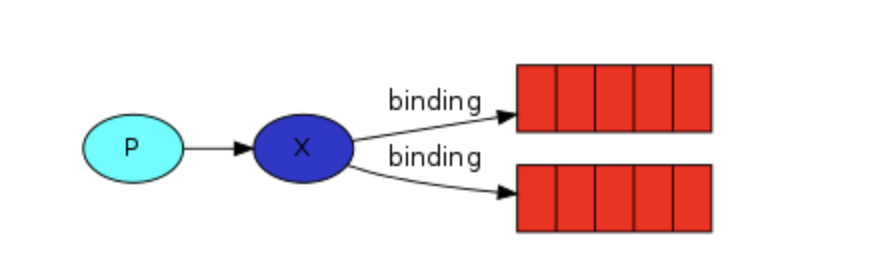

# Spring RabbitMQ example

This example shows how to create an [Java](https://www.oracle.com/ru/java/technologies/) application 
that uses different kinds of [RabbitMQ](https://www.rabbitmq.com/) exchanges: topic, fanout and direct.

* [Getting Started](#getting-started)
* [Exchanges](#exchanges)
* [Used technologies](#used-technologies)

## Getting Started

* Start RabbitMQ in your computer
* You may run test requests in `recources/request.htpp`
* Also, you should change email parameters in application.properties file

## Exchanges
There are 3 kinds of exchanges in this project: *Fanout* , *Direct* and *Topic*

#### Fanout

 ##### In this example, three queues bind to the fanout exchange
 * First queue writes statistic to an Excel file via [Apache POI](https://poi.apache.org/)
 * Second downloads image by url
 * Third generates a PDF document using a html template via [iText](https://itextpdf.com/ru/products/itext-7/itext-7-core)
 
#### Direct

##### In this example, only one queue bind to the direct exchange
 * Queue convert .txt template-file to html via [FreeMarker](https://freemarker.apache.org/) 
 and send messages to an email address via [Spring mail](https://docs.spring.io/spring-framework/docs/3.0.x/spring-framework-reference/html/mail.html).

#### Topic

##### In this example, only one queue bind to the direct exchange
 * Depending on the status of the user, the message is sent either by the key "account.confirmed" or "account.not_confirmed".
 * Two queues generate different .pdf docs, depending on the user's status.

## Used technologies

* [Maven](https://maven.apache.org/) to buid project
* [Java](https://www.oracle.com/ru/java/technologies/) language
* [Lombok](https://projectlombok.org/) annotations
* [RabbitMQ](https://www.rabbitmq.com/) to work with queues
* [Apache POI](https://poi.apache.org/) to work with excel files
* [iText](https://itextpdf.com/ru/products/itext-7/itext-7-core) to generate .pdf files
* [FreeMarker](https://freemarker.apache.org/) to create html page for sending to email
* [Spring mail](https://docs.spring.io/spring-framework/docs/3.0.x/spring-framework-reference/html/mail.html) to sending emails
* [JUnit](https://junit.org/junit4/) for testing
